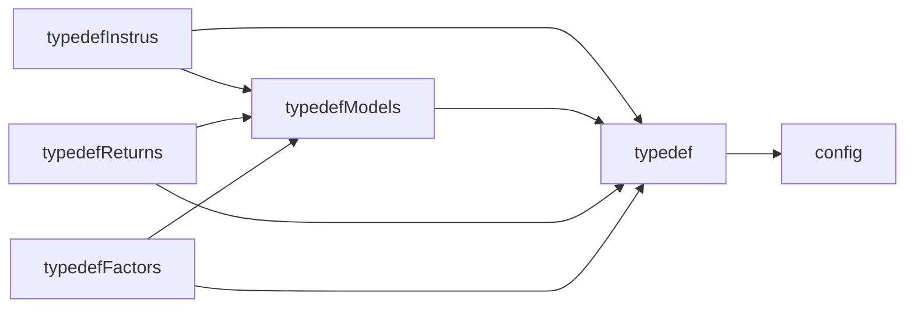

# 1. README

## 1.1. data structure

### 1.1.1. test_returns

+ test_returns_by_instru
    + opn
        + `I[0],I[1],...I[k-1]`
    + cls
        + `I[0],I[1],...I[k-1]`

+ test_returns_avlb_raw(avlb)
    + opn.db
    + cls.db

+ test_returns_avlb_neu(avlb + neutralize)
    + opn.db
    + cls.db

### 1.1.2. factors

make sure the algorithm of each factor is symmetrical about 0

+ factors_by_instru
    + F1
        + `I[0],I[1],...I[k-1]`
    + F2
        + `I[0],I[1],...I[k-1]`
    + F3
        + `I[0],I[1],...I[k-1]`
    + ...

+ factors_avlb_raw(avlb + winsorize + normalize)
    + F1.db
    + F2.db
    + F3.db
    + ...

+ factors_avlb_neu(avlb + neutralize)
    + F1.db
    + F2.db
    + F3.db
    + ...

### 1.1.3. ic-tests

+ data
    + F1_RAW_Cls001L1_RAW.db
    + F1_NEU_Cls001L1_NEU.db
    + ...
+ plot
    + F1_RAW_Cls001L1_RAW.pdf
    + F1_NEU_Cls001L1_NEU.pdf
    + ...

## 1.2. Steps to add a new factor

+ suppose the new factor class is 'XYZ'
+ create a file with name = 'xyz.py' in './factor_algs'
+ **Optional Step 1** create a new subclass of CCfgFactorGrp in './typedefs/typedefFactors.py', if necessary.
+ **Optional Step 2** create a new subclass of CCfgFactorGrp in './solutions/factor.py', if necessary.
+ give definition of 'CCfgFactorGrpXYZ' in xyz.py, it should inherit from new subclass created in **optional step 1** OR using existing ones, like
    + CCfgFactorGrpWin
    + CCfgFactorGrpWinLambda
    + CCfgFactorGrpLambda
+ give definition of 'CFactorXYZ' in xyz.py, it should inherit from new subclass created in **optional step 2** OR using existing ones, like
    + CFactorsByInstru
    + CFactorCORR
+ give args definition in 'factors' module of config.yaml
+ update run_all.ps1. If this factor has a good performance in IC test, and we want to keep it for further usage.
    + `python main.py --bgn $bgn_date_factor --stp $stp_date factor --fclass XYZ`
    + `python main.py --bgn $bgn_date --stp $stp_date ic --fclass XYZ`

## 1.3. Steps to add new models

config.yaml

+ update test_models

typedefs/typedefModels.py

+ update TModelType

mclrn.py

+ update import
+ give model definition

mclrn_parser.py

+ update import
+ update parse_config_to_mclrn_test

## 1.4. Topology for typedef

